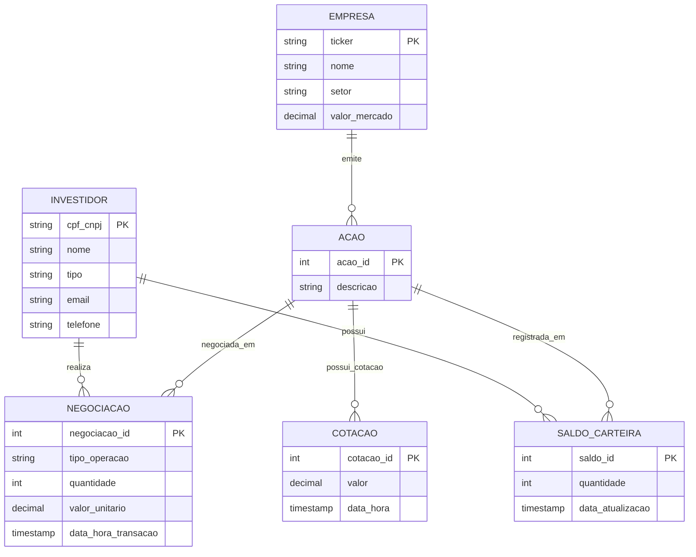

# Stock Exchange Database — Relational Model

A complete relational database design for a stock brokerage system, covering the full modeling pipeline: **Conceptual → Logical → Physical**.

Built for **PostgreSQL**, the schema handles real-time trade operations (OLTP) and historical portfolio analysis (OLAP) within a single, well-normalized design.

---

## Overview

The system manages the core entities of a brokerage operation:

- **Investors** — individuals (CPF) and legal entities (CNPJ)
- **Companies** — listed on the exchange, identified by ticker
- **Stocks** — issued by companies, with full trade history
- **Trades** — immutable buy/sell records per investor and stock
- **Price History** — append-only time series of stock quotes
- **Portfolio Balance** — consolidated position per investor per stock

Key design decisions:

- **SCD Type 2** on master data (Investors, Companies, Stocks) for complete change history
- **Immutable records** on Trades and Quotes — audit-safe, append-only
- **Hybrid OLTP + OLAP** support without schema redesign
- **Strong referential integrity** via FK constraints, CHECK constraints, and composite UNIQUE indexes

---

## Tech Stack

| Layer    | Technology        |
| -------- | ----------------- |
| Database | PostgreSQL 13+    |
| Modeling | 3NF + SCD Type 2  |
| Scripts  | DDL · DML · DQL   |

---

## Entity-Relationship Diagram



---

## Repository Structure

```
├── docs/
│   ├── PRD.md                  # Requirements, scope, and success criteria
│   ├── 01-conceptual-model.md  # ER diagram and entity definitions
│   └── 02-architecture.md      # Architecture decisions and design rationale
└── sql/
    ├── ddl.sql                 # CREATE TABLE with all constraints
    ├── dml.sql                 # INSERT / UPDATE / SCD Type 2 test operations
    └── dql.sql                 # SELECT queries — portfolio, history, reconciliation
```

---

## Running the Scripts

```bash
# Create the schema
psql -U <user> -d <database> -f sql/ddl.sql

# Load test data
psql -U <user> -d <database> -f sql/dml.sql

# Run analytical queries
psql -U <user> -d <database> -f sql/dql.sql
```

---

## Documentation

| Document | Description |
| -------- | ----------- |
| [PRD](docs/PRD.md) | Requirements, scope, and success criteria |
| [Conceptual Model](docs/01-conceptual-model.md) | Entities, attributes, and relationships |
| [Architecture](docs/02-architecture.md) | Design decisions and trade-offs |

---

## Author

Fernando Garbo
