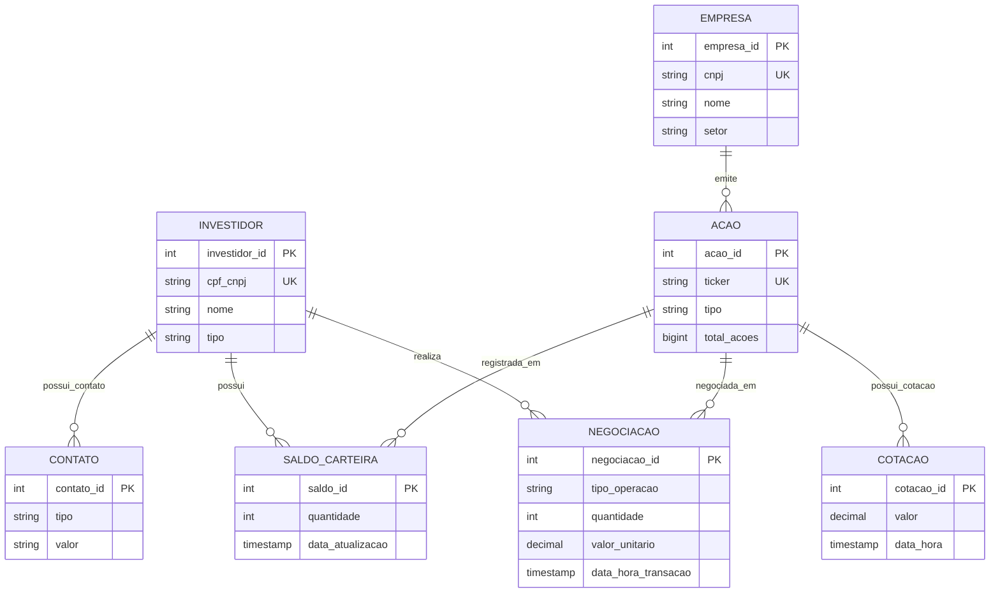

# Sistema de Gestão de Bolsa de Valores — Modelo Relacional

Design completo de banco de dados relacional para uma corretora de valores, cobrindo todo o pipeline de modelagem: **Conceitual → Lógico → Físico**.

Construído para **PostgreSQL**, o schema suporta operações transacionais em tempo real (OLTP) e análises históricas de carteira (OLAP) em um design único e bem normalizado.

---

## Visão Geral

O sistema gerencia as entidades centrais de uma operação de corretora:

- **Investidores** — pessoas físicas (CPF) e jurídicas (CNPJ)
- **Contatos** — múltiplos telefones, emails e WhatsApp por investidor
- **Empresas** — listadas na bolsa, identificadas por CNPJ
- **Ações** — emitidas por empresas, identificadas por ticker (ex: PETR3, SANB4)
- **Negociações** — registros imutáveis de compra/venda por investidor e ação
- **Cotações** — série temporal append-only de preços por ação
- **Saldo de Carteira** — posição consolidada por par investidor × ação

Principais decisões de design:

- **SCD Type 2** em dados mestres (Investidores, Empresas, Ações) para histórico completo de mudanças
- **Registros imutáveis** em Negociações e Cotações — apenas INSERT, trilha de auditoria garantida
- **Trigger automático** mantém o Saldo de Carteira consistente após cada negociação
- **Suporte híbrido OLTP + OLAP** sem necessidade de redesign futuro
- **Integridade referencial forte** via constraints FK, CHECK e índices UNIQUE compostos

---

## Tecnologias

| Camada | Tecnologia |
| --- | --- |
| Banco de Dados | PostgreSQL 13+ |
| Modelagem | 3FN + SCD Type 2 |
| Scripts | DDL · DML · DQL |

---

## Diagrama Entidade-Relacionamento



---

## Estrutura do Repositório

```
├── docs/
│   ├── PRD.md                  # Requisitos, escopo e critérios de sucesso
│   ├── 01-conceptual-model.md  # Diagrama ER e definição das entidades
│   ├── 02-architecture.md      # Decisões arquiteturais e justificativas
│   ├── 03-logical-model.md     # Schema 3FN, tipos, constraints e SCD Type 2
│   ├── modeloConceitual.png    # Diagrama ER exportado do BrModelo
│   └── project-context.md      # Contexto geral e estado atual do projeto
└── sql/
    ├── ddl.sql                 # CREATE TABLE, índices, VIEW e trigger
    ├── dml.sql                 # INSERT / UPDATE / operações SCD Type 2
    └── dql.sql                 # SELECT — carteira, histórico, reconciliação
```

---

## Executando os Scripts

Os scripts devem ser executados na ordem abaixo. O `ddl.sql` inclui `DROP` de todos os objetos antes de recriá-los — seguro para re-execução.

```bash
# 1. Criar o schema (tabelas, índices, view e trigger)
psql -U <usuario> -d <banco> -f sql/ddl.sql

# 2. Carregar dados de teste
psql -U <usuario> -d <banco> -f sql/dml.sql

# 3. Executar consultas analíticas
psql -U <usuario> -d <banco> -f sql/dql.sql
```

---

## Documentação

| Documento | Descrição |
| --- | --- |
| [PRD](docs/PRD.md) | Requisitos, escopo e critérios de sucesso |
| [Modelo Conceitual](docs/01-conceptual-model.md) | Entidades, atributos e relacionamentos |
| [Arquitetura](docs/02-architecture.md) | Decisões de design e justificativas |
| [Modelo Lógico](docs/03-logical-model.md) | Schema 3FN, tipos de dados, constraints e SCD Type 2 |

---

## Autor

Fernando Garbo
