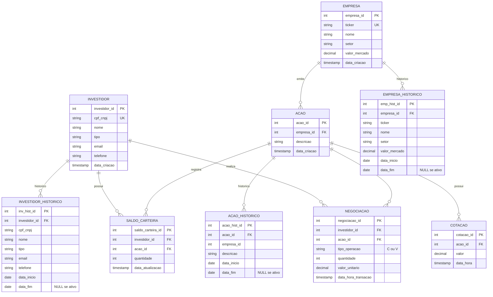

# Modelo Conceitual - Sistema de Gestão de Bolsa de Valores

**Data:** 2026-04-21  
**Versão:** 1.0  
**Status:** Para Validação

---

## 📋 Resumo Executivo

O modelo conceitual define as entidades principais e seus relacionamentos para um sistema de gestão de bolsa de valores. A estrutura suporta:
- **OLTP:** Negociações em tempo real
- **OLAP:** Relatórios e análises históricas
- **SCD Type 2:** Histórico completo de mudanças em dados mestres
- **Integridade Referencial:** Relacionamentos fortes entre entidades

---

## 🎨 Diagrama ER (Entidade-Relacionamento)



---

## 📊 Entidades Detalhadas

### 1. **INVESTIDOR** (Dados Mestres com SCD Type 2)

**Propósito:** Armazenar informações de investidores (PF ou PJ)

| Atributo | Tipo | Descrição | Constraint |
|----------|------|-----------|-----------|
| investidor_id | Integer | Identificador único | PK |
| cpf_cnpj | String(20) | CPF ou CNPJ | UNIQUE, NOT NULL |
| nome | String(200) | Nome completo | NOT NULL |
| tipo | String(2) | PF (Pessoa Física) ou PJ (Pessoa Jurídica) | NOT NULL, CHECK (tipo IN ('PF', 'PJ')) |
| email | String(100) | Email de contato | NOT NULL |
| telefone | String(20) | Telefone de contato | |
| data_criacao | Timestamp | Data de criação do registro | NOT NULL |

**Histórico:** `INVESTIDOR_HISTORICO` (SCD Type 2)

---

### 2. **INVESTIDOR_HISTORICO** (SCD Type 2)

**Propósito:** Rastrear mudanças em dados de investidores ao longo do tempo

| Atributo | Tipo | Descrição | Constraint |
|----------|------|-----------|-----------|
| inv_hist_id | Integer | Identificador único | PK |
| investidor_id | Integer | Referência ao investidor | FK → INVESTIDOR |
| cpf_cnpj | String(20) | CPF ou CNPJ (versão histórica) | NOT NULL |
| nome | String(200) | Nome (versão histórica) | NOT NULL |
| tipo | String(2) | Tipo (versão histórica) | NOT NULL |
| email | String(100) | Email (versão histórica) | |
| telefone | String(20) | Telefone (versão histórica) | |
| data_inicio | Date | Data de início dessa versão | NOT NULL |
| data_fim | Date | Data de fim dessa versão (NULL se ativo) | |

**SCD Type 2:** Quando um investidor muda, marca `data_fim` na linha anterior e insere nova linha com `data_inicio`

---

### 3. **EMPRESA** (Dados Mestres com SCD Type 2)

**Propósito:** Armazenar informações de empresas listadas na bolsa

| Atributo | Tipo | Descrição | Constraint |
|----------|------|-----------|-----------|
| empresa_id | Integer | Identificador único | PK |
| ticker | String(10) | Código de negociação | UNIQUE, NOT NULL |
| nome | String(200) | Nome da empresa | NOT NULL |
| setor | String(100) | Setor de atuação | NOT NULL |
| valor_mercado | Decimal(15,2) | Valor de mercado em R$ | |
| data_criacao | Timestamp | Data de criação | NOT NULL |

**Histórico:** `EMPRESA_HISTORICO` (SCD Type 2)

---

### 4. **EMPRESA_HISTORICO** (SCD Type 2)

**Propósito:** Rastrear mudanças em empresas (setor, valor de mercado, etc.)

| Atributo | Tipo | Descrição | Constraint |
|----------|------|-----------|-----------|
| emp_hist_id | Integer | Identificador único | PK |
| empresa_id | Integer | Referência à empresa | FK → EMPRESA |
| ticker | String(10) | Ticker (versão histórica) | NOT NULL |
| nome | String(200) | Nome (versão histórica) | NOT NULL |
| setor | String(100) | Setor (versão histórica) | NOT NULL |
| valor_mercado | Decimal(15,2) | Valor de mercado (versão histórica) | |
| data_inicio | Date | Data de início dessa versão | NOT NULL |
| data_fim | Date | Data de fim (NULL se ativo) | |

---

### 5. **ACAO** (Dados Mestres com SCD Type 2)

**Propósito:** Armazenar informações de ações emitidas por empresas

| Atributo | Tipo | Descrição | Constraint |
|----------|------|-----------|-----------|
| acao_id | Integer | Identificador único | PK |
| empresa_id | Integer | Empresa que emitiu | FK → EMPRESA |
| descricao | String(200) | Descrição da ação (ex: Ordinária, Preferencial) | NOT NULL |
| data_criacao | Timestamp | Data de criação | NOT NULL |

**Histórico:** `ACAO_HISTORICO` (SCD Type 2)

---

### 6. **ACAO_HISTORICO** (SCD Type 2)

**Propósito:** Rastrear mudanças em ações

| Atributo | Tipo | Descrição | Constraint |
|----------|------|-----------|-----------|
| acao_hist_id | Integer | Identificador único | PK |
| acao_id | Integer | Referência à ação | FK → ACAO |
| empresa_id | Integer | Empresa (versão histórica) | FK → EMPRESA |
| descricao | String(200) | Descrição (versão histórica) | NOT NULL |
| data_inicio | Date | Data de início dessa versão | NOT NULL |
| data_fim | Date | Data de fim (NULL se ativo) | |

---

### 7. **NEGOCIACAO** (Transacional, Imutável - SCD Type 1)

**Propósito:** Registrar todas as operações de compra e venda

| Atributo | Tipo | Descrição | Constraint |
|----------|------|-----------|-----------|
| negociacao_id | Integer | Identificador único | PK |
| investidor_id | Integer | Investidor que fez a operação | FK → INVESTIDOR |
| acao_id | Integer | Ação negociada | FK → ACAO |
| tipo_operacao | String(1) | 'C' (Compra) ou 'V' (Venda) | NOT NULL, CHECK (tipo_operacao IN ('C', 'V')) |
| quantidade | Integer | Quantidade de ações | NOT NULL, CHECK (quantidade > 0) |
| valor_unitario | Decimal(10,2) | Preço por ação na negociação | NOT NULL, CHECK (valor_unitario > 0) |
| data_hora_transacao | Timestamp | Data e hora exata da negociação | NOT NULL |

**Imutável:** Nunca atualizar ou deletar. Tudo é rastreável por data/hora.

---

### 8. **COTACAO** (Histórico de Preços, Append-only - SCD Type 1)

**Propósito:** Manter histórico de cotações de cada ação

| Atributo | Tipo | Descrição | Constraint |
|----------|------|-----------|-----------|
| cotacao_id | Integer | Identificador único | PK |
| acao_id | Integer | Ação | FK → ACAO |
| valor | Decimal(10,4) | Preço da ação naquele momento | NOT NULL, CHECK (valor > 0) |
| data_hora | Timestamp | Data e hora da cotação | NOT NULL |

**Append-only:** Nunca atualizar ou deletar. Apenas inserir novos registros.

---

### 9. **SALDO_CARTEIRA** (Posição Consolidada)

**Propósito:** Registrar quantas ações cada investidor possui

| Atributo | Tipo | Descrição | Constraint |
|----------|------|-----------|-----------|
| saldo_carteira_id | Integer | Identificador único | PK |
| investidor_id | Integer | Investidor | FK → INVESTIDOR |
| acao_id | Integer | Ação | FK → ACAO |
| quantidade | Integer | Quantidade em posição | NOT NULL, CHECK (quantidade >= 0) |
| data_atualizacao | Timestamp | Última atualização | NOT NULL |

**Índice Composto:** (investidor_id, acao_id) UNIQUE para garantir um registro por investidor-ação

---

## 🔗 Relacionamentos Detalhados

| Relacionamento | Tipo | Descrição | Integridade |
|---|---|---|---|
| INVESTIDOR → NEGOCIACAO | 1:M | Um investidor realiza múltiplas negociações | FK NOT NULL |
| INVESTIDOR → SALDO_CARTEIRA | 1:M | Um investidor tem saldos em múltiplas ações | FK NOT NULL |
| EMPRESA → ACAO | 1:M | Uma empresa emite uma ou mais ações | FK NOT NULL |
| ACAO → NEGOCIACAO | 1:M | Uma ação é negociada múltiplas vezes | FK NOT NULL |
| ACAO → COTACAO | 1:M | Uma ação tem múltiplas cotações | FK NOT NULL |
| ACAO → SALDO_CARTEIRA | 1:M | Uma ação é mantida em múltiplas carteiras | FK NOT NULL |

---

## 🎯 Decisões de Design

### 1. **SCD Type 2 para Dados Mestres**
- **Por quê:** Precisamos rastrear mudanças históricas em Investidores, Empresas e Ações
- **Como:** Tabelas de histórico com `data_inicio` e `data_fim`
- **Benefício:** Relatórios históricos são precisos ("qual era o setor em 2024?")

### 2. **NEGOCIACAO e COTACAO são Imutáveis (Type 1)**
- **Por quê:** Registros de transações NUNCA devem ser alterados (auditoria, conformidade)
- **Como:** Apenas INSERT, nunca UPDATE/DELETE
- **Benefício:** Trilha de auditoria completa e inquestionável

### 3. **SALDO_CARTEIRA é Desnormalizado**
- **Por quê:** Permite consultas rápidas de posição sem agregar NEGOCIACAO
- **Como:** Atualizado via trigger ou application logic após cada NEGOCIACAO
- **Benefício:** Performance em relatórios de carteira

### 4. **Chaves Únicas para Dados Mestres**
- **investidor_id:** CPF/CNPJ UNIQUE (não pode haver duplicata)
- **empresa_id:** Ticker UNIQUE (código de negociação é único)
- **saldo_carteira_id:** (investidor_id, acao_id) UNIQUE (um investidor, uma ação = um registro)

### 5. **Constraints de Negócio**
- `tipo_operacao IN ('C', 'V')` → Apenas Compra ou Venda
- `tipo IN ('PF', 'PJ')` → Apenas Pessoa Física ou Jurídica
- `quantidade > 0` e `valor_unitario > 0` → Valores positivos
- `saldo_carteira.quantidade >= 0` → Saldo nunca negativo

---

## 📌 Notas Importantes

1. **Histórico (SCD Type 2):** Quando dados mestres mudam, a operação é:
   ```
   UPDATE tabela_historico SET data_fim = TODAY() WHERE id = X AND data_fim IS NULL
   INSERT INTO tabela_historico (id_ref, campos..., data_inicio, data_fim) VALUES (X, ..., TODAY(), NULL)
   UPDATE tabela_mestre SET campos... WHERE id = X
   ```

2. **Reconciliação:** É possível validar:
   - `SUM(NEGOCIACAO.quantidade WHERE tipo='C') - SUM(NEGOCIACAO.quantidade WHERE tipo='V') = SALDO_CARTEIRA.quantidade`

3. **Escalabilidade:** O modelo suporta:
   - Múltiplos investidores
   - Múltiplas ações
   - Histórico completo de cotações
   - Análises retrospectivas

---

## ✅ Validação

- [x] Todas as entidades identificadas
- [x] Relacionamentos mapeados
- [x] SCD Type 2 definido para dados mestres
- [x] Constraints de negócio documentados
- [x] Decisões justificadas

---

**Status:** ⏳ **AGUARDANDO VALIDAÇÃO DO USUÁRIO**

Você aprova este modelo conceitual para prosseguirmos para o **Modelo Lógico**?
