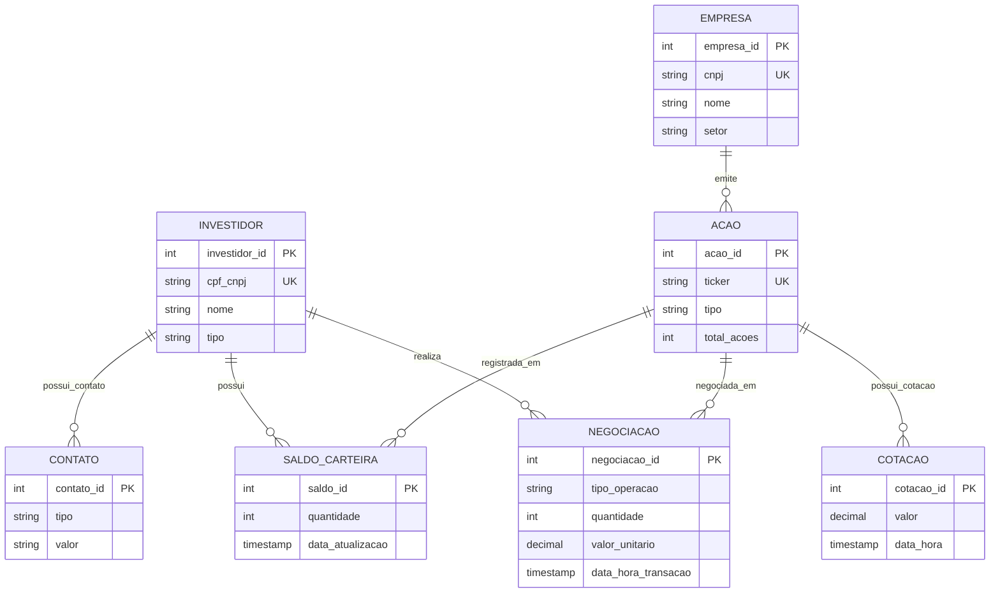

# Modelo Conceitual - Sistema de Gestão de Bolsa de Valores

**Data:** 2026-05-17
**Versão:** 1.3
**Status:** Validado

---

## Resumo Executivo

O modelo conceitual define as entidades de negócio e seus relacionamentos para um sistema de gestão de bolsa de valores. A estrutura suporta:

- **OLTP:** Negociações em tempo real
- **OLAP:** Relatórios e análises históricas
- **Integridade Referencial:** Relacionamentos fortes entre entidades

> **Nota de Design:** A necessidade de rastrear histórico de mudanças em dados mestres (Investidores, Empresas, Ações) é um requisito de negócio. O mecanismo de implementação desse histórico (padrão SCD Type 2) é uma decisão de design registrada no Modelo Lógico.

---

## Diagrama ER (Entidade-Relacionamento)

---

## Entidades Detalhadas

### 1. INVESTIDOR

**Propósito:** Armazenar informações de investidores (PF ou PJ)

| Atributo | Tipo | Descrição | Constraint |
| --- | --- | --- | --- |
| investidor_id | Inteiro | Identificador surrogate | PK, gerado pelo banco |
| cpf_cnpj | String | CPF (PF) ou CNPJ (PJ) | UNIQUE, Obrigatório |
| nome | String | Nome completo | Obrigatório |
| tipo | String | PF ou PJ | Obrigatório |

> Dados de contato (telefone, email) foram extraídos para a entidade **CONTATO**, permitindo múltiplos contatos por investidor.

**Requisito de negócio:** Mudanças nos dados do investidor devem ser rastreadas com histórico completo.

---

### 2. EMPRESA

**Propósito:** Armazenar informações de empresas listadas na bolsa

| Atributo | Tipo | Descrição | Constraint |
| --- | --- | --- | --- |
| empresa_id | Inteiro | Identificador surrogate | PK, gerado pelo banco |
| cnpj | String | CNPJ da empresa | UNIQUE, Obrigatório |
| nome | String | Nome da empresa | Obrigatório |
| setor | String | Setor de atuação | Obrigatório |

> `valor_mercado` é atributo **derivado** — calculado como `total_acoes × cotação atual` via VIEW no modelo físico. Não armazenado para evitar redundância e inconsistência.

**Requisito de negócio:** Mudanças nos dados da empresa devem ser rastreadas com histórico completo.

---

### 3. ACAO

**Propósito:** Armazenar ações emitidas por empresas, identificadas pelo ticker

| Atributo | Tipo | Descrição | Constraint |
| --- | --- | --- | --- |
| acao_id | Inteiro | Identificador surrogate | PK, gerado pelo banco |
| ticker | String | Código de negociação na bolsa | UNIQUE, Obrigatório |
| tipo | String | Tipo da ação: ON, PN ou UNT | Obrigatório |
| total_acoes | Inteiro | Total de ações emitidas pela empresa | Obrigatório, positivo |

**Requisito de negócio:** Mudanças nas características de uma ação devem ser rastreadas com histórico completo.

---

### 4. CONTATO

**Propósito:** Armazenar múltiplos dados de contato por investidor (telefones, emails)

| Atributo | Tipo | Descrição | Constraint |
| --- | --- | --- | --- |
| contato_id | Inteiro | Identificador surrogate | PK, gerado pelo banco |
| tipo | String | Tipo do contato: TEL, EML, WHT | Obrigatório |
| valor | String | Valor do contato (número ou endereço) | Obrigatório |

> Extraída de INVESTIDOR para suportar múltiplos contatos por pessoa. Substitui os campos `email` e `telefone` que existiam diretamente em INVESTIDOR.

---

### 5. NEGOCIACAO

**Propósito:** Registrar todas as operações de compra e venda — entidade associativa entre INVESTIDOR e ACAO

| Atributo | Tipo | Descrição | Constraint |
| --- | --- | --- | --- |
| negociacao_id | Inteiro | Identificador surrogate | PK, gerado pelo banco |
| tipo_operacao | String | Compra (C) ou Venda (V) | Obrigatório |
| quantidade | Inteiro | Quantidade de ações | Obrigatório, positivo |
| valor_unitario | Decimal | Preço por ação no momento | Obrigatório, positivo |
| data_hora_transacao | Timestamp | Data e hora exata da negociação | Obrigatório |

> `valor_total` é atributo **derivado** (quantidade × valor_unitario) — não armazenado, calculado nas consultas.

**Regra de negócio:** Registros são imutáveis — apenas INSERT, nunca UPDATE ou DELETE.

---

### 6. COTACAO

**Propósito:** Manter histórico de preços das ações ao longo do tempo

| Atributo | Tipo | Descrição | Constraint |
| --- | --- | --- | --- |
| cotacao_id | Inteiro | Identificador surrogate | PK, gerado pelo banco |
| valor | Decimal | Preço da ação no momento | Obrigatório, positivo |
| data_hora | Timestamp | Data e hora da cotação | Obrigatório |

**Regra de negócio:** Append-only — apenas inserções, nunca atualizações ou remoções.

---

### 7. SALDO_CARTEIRA

**Propósito:** Registrar a posição atual de cada investidor por ação

| Atributo | Tipo | Descrição | Constraint |
| --- | --- | --- | --- |
| saldo_id | Inteiro | Identificador surrogate | PK, gerado pelo banco |
| quantidade | Inteiro | Quantidade de ações em posição | Obrigatório, não negativo |
| data_atualizacao | Timestamp | Data da última atualização | Obrigatório |

> `valor_atual` é atributo **derivado** (quantidade × cotação atual) — calculado sob demanda via JOIN com COTACAO.

**Regras de negócio:**
- Unicidade: um único registro por par `(investidor_id, acao_id)`
- Quantidade pode ser 0 — registro mantido para preservar histórico da posição
- Atualizado via **trigger** após cada INSERT em NEGOCIACAO

---

## Relacionamentos

| Relacionamento | Entidades | Cardinalidade | Descrição |
| --- | --- | --- | --- |
| emite | EMPRESA → ACAO | (0,n):(1,1) | Uma empresa pode ter zero ou mais ações (ex: pré-IPO ou ação retirada da bolsa); toda ação pertence a exatamente uma empresa |
| realiza | INVESTIDOR → NEGOCIACAO | (0,n):(1,1) | Um investidor pode ter zero ou mais negociações; toda negociação pertence a exatamente um investidor |
| negociada_em | ACAO → NEGOCIACAO | (0,n):(1,1) | Uma ação pode ter zero ou mais negociações; toda negociação envolve exatamente uma ação |
| possui_cotacao | ACAO → COTACAO | (0,n):(1,1) | Uma ação pode ter zero ou mais cotações; toda cotação pertence a exatamente uma ação |
| possui | INVESTIDOR → SALDO_CARTEIRA | (0,n):(1,1) | Um investidor pode ter zero ou mais registros de saldo; todo saldo pertence a exatamente um investidor |
| registrada_em | ACAO → SALDO_CARTEIRA | (0,n):(1,1) | Uma ação pode ter zero ou mais registros de saldo; todo saldo referencia exatamente uma ação |
| possui_contato | INVESTIDOR → CONTATO | (0,n):(1,1) | Um investidor pode ter zero ou mais contatos; todo contato pertence a exatamente um investidor |

---

## Decisões de Design (para o Modelo Lógico)

| Decisão | Entidades afetadas | Descrição |
| --- | --- | --- |
| Surrogate keys | Todas | Todas as entidades usam surrogate PK (inteiro gerado); chaves de negócio como UNIQUE |
| SCD Type 2 | INVESTIDOR, EMPRESA, ACAO | Rastreamento de histórico via tabelas auxiliares com `data_inicio` e `data_fim` |
| Imutabilidade | NEGOCIACAO, COTACAO | Apenas INSERT — garantia de trilha de auditoria |
| Chave mista CPF/CNPJ | INVESTIDOR | Armazenar apenas dígitos (VARCHAR(14)); CHECK composto vinculando `tipo` ao comprimento |
| CNPJ alfanumérico | EMPRESA | IN RFB 2.229/2024 muda formato do CNPJ — surrogate key isola FKs do impacto |
| Tipo de ação | ACAO | Campo `tipo` controlado: ON (Ordinária), PN (Preferencial), UNT (Units) |
| Atributos derivados | NEGOCIACAO, SALDO_CARTEIRA, EMPRESA | `valor_total`, `valor_atual` e `valor_mercado` calculados em consulta — não persistidos |
| Trigger | SALDO_CARTEIRA | Saldo atualizado via trigger após INSERT em NEGOCIACAO |
| Entidade CONTATO | INVESTIDOR | Entidade separada para múltiplos contatos por investidor; `email` e `telefone` removidos de INVESTIDOR |
| valor_mercado derivado | EMPRESA, ACAO | Calculado como `total_acoes × cotacao_atual`; exposto como VIEW `vw_valor_mercado` no modelo físico |
| UNIQUE em COTACAO | COTACAO | Surrogate PK (cotacao_id) + UNIQUE (acao_id, data_hora) para evitar duas cotações no mesmo instante |
| Cisão societária | ACAO, EMPRESA | SCD Type 2 em ACAO trata cisão: nova versão do registro com novo empresa_id preserva histórico |

---

**Status:** ✅ MODELO CONCEITUAL VALIDADO — Pronto para avançar ao Modelo Lógico
