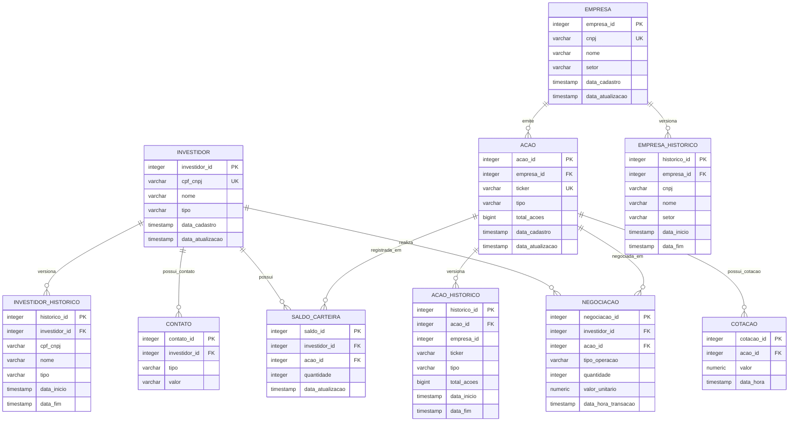

# Modelo Lógico — Sistema de Gestão de Bolsa de Valores

**Autor:** Fernando Garbo
**Data:** 2026-05-17
**Versão:** 1.0
**Status:** Validado

---

## Visão Geral

O modelo lógico traduz as entidades conceituais em um schema relacional normalizado (3FN) para PostgreSQL. Implementa:

- **SCD Type 2** em tabelas mestres (INVESTIDOR, EMPRESA, ACAO) via tabelas auxiliares de histórico
- **Registros imutáveis** em NEGOCIACAO e COTACAO
- **Atributos derivados** não persistidos: `valor_total`, `valor_atual`, `valor_mercado`
- **Trigger** para manutenção automática de SALDO_CARTEIRA após negociações
- **VIEW** `vw_valor_mercado` para cálculo de capitalização de mercado

---

## Diagrama de Schema



---

## Tabelas Principais

### 1. INVESTIDOR

| Coluna | Tipo | Constraints | Descrição |
| --- | --- | --- | --- |
| investidor_id | INTEGER | PK, GENERATED ALWAYS AS IDENTITY | Surrogate key |
| cpf_cnpj | VARCHAR(14) | NOT NULL, UNIQUE | Apenas dígitos: CPF (11) ou CNPJ (14) |
| nome | VARCHAR(255) | NOT NULL | Nome completo ou razão social |
| tipo | VARCHAR(2) | NOT NULL, CHECK IN ('PF','PJ') | Pessoa Física ou Jurídica |
| data_cadastro | TIMESTAMP | NOT NULL, DEFAULT CURRENT_TIMESTAMP | Data de criação do registro |
| data_atualizacao | TIMESTAMP | NOT NULL, DEFAULT CURRENT_TIMESTAMP | Início da versão atual |

**Constraints adicionais:**

```sql
CHECK (
    (tipo = 'PF' AND LENGTH(cpf_cnpj) = 11) OR
    (tipo = 'PJ' AND LENGTH(cpf_cnpj) = 14)
)
```

> `data_atualizacao` marca quando a versão atual foi estabelecida. A versão anterior está em INVESTIDOR_HISTORICO.

---

### 2. CONTATO

| Coluna | Tipo | Constraints | Descrição |
| --- | --- | --- | --- |
| contato_id | INTEGER | PK, GENERATED ALWAYS AS IDENTITY | Surrogate key |
| investidor_id | INTEGER | NOT NULL, FK → INVESTIDOR(investidor_id) | Dono do contato |
| tipo | VARCHAR(3) | NOT NULL, CHECK IN ('TEL','EML','WHT') | Tipo: Telefone, Email, WhatsApp |
| valor | VARCHAR(255) | NOT NULL | Número ou endereço de email |

**Constraints adicionais:**

```sql
UNIQUE (investidor_id, tipo, valor)
```

> Padrão `tipo + valor` evita colunas nulas e suporta N contatos de qualquer tipo por investidor.

---

### 3. EMPRESA

| Coluna | Tipo | Constraints | Descrição |
| --- | --- | --- | --- |
| empresa_id | INTEGER | PK, GENERATED ALWAYS AS IDENTITY | Surrogate key |
| cnpj | VARCHAR(14) | NOT NULL, UNIQUE | CNPJ sem formatação (suporta alfanumérico — IN RFB 2.229/2024) |
| nome | VARCHAR(255) | NOT NULL | Razão social |
| setor | VARCHAR(100) | NOT NULL | Setor de atuação na B3 |
| data_cadastro | TIMESTAMP | NOT NULL, DEFAULT CURRENT_TIMESTAMP | Data de criação |
| data_atualizacao | TIMESTAMP | NOT NULL, DEFAULT CURRENT_TIMESTAMP | Início da versão atual |

> Surrogate key `empresa_id` isola todas as FKs de mudanças futuras no formato do CNPJ.

---

### 4. ACAO

| Coluna | Tipo | Constraints | Descrição |
| --- | --- | --- | --- |
| acao_id | INTEGER | PK, GENERATED ALWAYS AS IDENTITY | Surrogate key |
| empresa_id | INTEGER | NOT NULL, FK → EMPRESA(empresa_id) | Empresa emissora |
| ticker | VARCHAR(10) | NOT NULL, UNIQUE | Código de negociação (ex: PETR3, SANB11) |
| tipo | VARCHAR(3) | NOT NULL, CHECK IN ('ON','PN','UNT') | Ordinária, Preferencial ou Units |
| total_acoes | BIGINT | NOT NULL, CHECK > 0 | Total de ações emitidas |
| data_cadastro | TIMESTAMP | NOT NULL, DEFAULT CURRENT_TIMESTAMP | Data de criação |
| data_atualizacao | TIMESTAMP | NOT NULL, DEFAULT CURRENT_TIMESTAMP | Início da versão atual |

> `total_acoes` usa BIGINT: grandes empresas (ex: Petrobras) superam o limite de INTEGER (~2,1 bilhões).

---

### 5. NEGOCIACAO

| Coluna | Tipo | Constraints | Descrição |
| --- | --- | --- | --- |
| negociacao_id | INTEGER | PK, GENERATED ALWAYS AS IDENTITY | Surrogate key |
| investidor_id | INTEGER | NOT NULL, FK → INVESTIDOR(investidor_id) | Investidor que realizou a operação |
| acao_id | INTEGER | NOT NULL, FK → ACAO(acao_id) | Ação negociada |
| tipo_operacao | VARCHAR(1) | NOT NULL, CHECK IN ('C','V') | Compra ou Venda |
| quantidade | INTEGER | NOT NULL, CHECK > 0 | Quantidade de ações |
| valor_unitario | NUMERIC(15,2) | NOT NULL, CHECK > 0 | Preço por ação no momento |
| data_hora_transacao | TIMESTAMP | NOT NULL, DEFAULT CURRENT_TIMESTAMP | Data e hora da operação |

> **Registro imutável:** apenas INSERT. Sem UPDATE ou DELETE.
> `valor_total` é atributo derivado (`quantidade × valor_unitario`) — calculado em consulta.

---

### 6. COTACAO

| Coluna | Tipo | Constraints | Descrição |
| --- | --- | --- | --- |
| cotacao_id | INTEGER | PK, GENERATED ALWAYS AS IDENTITY | Surrogate key |
| acao_id | INTEGER | NOT NULL, FK → ACAO(acao_id) | Ação cotada |
| valor | NUMERIC(15,2) | NOT NULL, CHECK > 0 | Preço da ação |
| data_hora | TIMESTAMP | NOT NULL | Data e hora da cotação |

**Constraints adicionais:**

```sql
UNIQUE (acao_id, data_hora)
```

> **Append-only:** apenas INSERT. UNIQUE composta impede duplicata no mesmo instante.

---

### 7. SALDO_CARTEIRA

| Coluna | Tipo | Constraints | Descrição |
| --- | --- | --- | --- |
| saldo_id | INTEGER | PK, GENERATED ALWAYS AS IDENTITY | Surrogate key |
| investidor_id | INTEGER | NOT NULL, FK → INVESTIDOR(investidor_id) | Investidor titular |
| acao_id | INTEGER | NOT NULL, FK → ACAO(acao_id) | Ação em carteira |
| quantidade | INTEGER | NOT NULL, CHECK >= 0 | Posição atual em ações |
| data_atualizacao | TIMESTAMP | NOT NULL, DEFAULT CURRENT_TIMESTAMP | Data da última movimentação |

**Constraints adicionais:**

```sql
UNIQUE (investidor_id, acao_id)
```

> Mantido por trigger após cada INSERT em NEGOCIACAO. `quantidade = 0` é válido (investidor zerou a posição mas histórico é preservado).
> `valor_atual` é derivado (`quantidade × cotação atual`) — calculado via JOIN com COTACAO.

---

## Tabelas de Histórico — SCD Type 2

Quando dados mestres são alterados, o registro anterior é arquivado na tabela de histórico antes da atualização. A tabela principal sempre contém o **estado atual**.

### Protocolo de Atualização (SCD Type 2)

```
1. INSERT INTO <entidade>_HISTORICO
       SELECT ..., data_atualizacao AS data_inicio, CURRENT_TIMESTAMP AS data_fim
       FROM <entidade> WHERE <entidade>_id = :id

2. UPDATE <entidade>
       SET <colunas alteradas>, data_atualizacao = CURRENT_TIMESTAMP
       WHERE <entidade>_id = :id
```

---

### INVESTIDOR_HISTORICO

| Coluna | Tipo | Constraints | Descrição |
| --- | --- | --- | --- |
| historico_id | INTEGER | PK, GENERATED ALWAYS AS IDENTITY | Surrogate key |
| investidor_id | INTEGER | NOT NULL, FK → INVESTIDOR(investidor_id) | Referência ao investidor |
| cpf_cnpj | VARCHAR(14) | NOT NULL | Snapshot do CPF/CNPJ na época |
| nome | VARCHAR(255) | NOT NULL | Snapshot do nome |
| tipo | VARCHAR(2) | NOT NULL | Snapshot do tipo (PF/PJ) |
| data_inicio | TIMESTAMP | NOT NULL | Início da vigência desta versão |
| data_fim | TIMESTAMP | NOT NULL | Fim da vigência (sempre preenchido) |

---

### EMPRESA_HISTORICO

| Coluna | Tipo | Constraints | Descrição |
| --- | --- | --- | --- |
| historico_id | INTEGER | PK, GENERATED ALWAYS AS IDENTITY | Surrogate key |
| empresa_id | INTEGER | NOT NULL, FK → EMPRESA(empresa_id) | Referência à empresa |
| cnpj | VARCHAR(14) | NOT NULL | Snapshot do CNPJ |
| nome | VARCHAR(255) | NOT NULL | Snapshot da razão social |
| setor | VARCHAR(100) | NOT NULL | Snapshot do setor |
| data_inicio | TIMESTAMP | NOT NULL | Início da vigência |
| data_fim | TIMESTAMP | NOT NULL | Fim da vigência |

---

### ACAO_HISTORICO

| Coluna | Tipo | Constraints | Descrição |
| --- | --- | --- | --- |
| historico_id | INTEGER | PK, GENERATED ALWAYS AS IDENTITY | Surrogate key |
| acao_id | INTEGER | NOT NULL, FK → ACAO(acao_id) | Referência à ação |
| empresa_id | INTEGER | NOT NULL | Snapshot da empresa emissora (cópia, não FK) |
| ticker | VARCHAR(10) | NOT NULL | Snapshot do ticker |
| tipo | VARCHAR(3) | NOT NULL | Snapshot do tipo (ON/PN/UNT) |
| total_acoes | BIGINT | NOT NULL | Snapshot do total de ações |
| data_inicio | TIMESTAMP | NOT NULL | Início da vigência |
| data_fim | TIMESTAMP | NOT NULL | Fim da vigência |

> `empresa_id` em ACAO_HISTORICO é armazenado como cópia simples (sem FK) para preservar integridade do snapshot histórico mesmo que a empresa seja futuramente inativada.

> **Cisão societária:** quando uma ação muda de empresa emissora, o SCD Type 2 registra a versão anterior (com o `empresa_id` antigo) e a versão nova contém o novo `empresa_id`.

---

## Objetos Derivados

### VIEW — vw_valor_mercado

Calcula a capitalização de mercado de cada ação com base na cotação mais recente.

```sql
CREATE VIEW vw_valor_mercado AS
SELECT
    e.empresa_id,
    e.nome                          AS empresa,
    a.acao_id,
    a.ticker,
    a.total_acoes,
    c.valor                         AS cotacao_atual,
    a.total_acoes * c.valor         AS valor_mercado,
    c.data_hora                     AS data_cotacao
FROM empresa e
JOIN acao a ON a.empresa_id = e.empresa_id
JOIN cotacao c ON c.acao_id = a.acao_id
WHERE c.data_hora = (
    SELECT MAX(c2.data_hora)
    FROM cotacao c2
    WHERE c2.acao_id = a.acao_id
);
```

---

### TRIGGER — trg_atualiza_saldo_carteira

Mantém SALDO_CARTEIRA automaticamente após cada negociação.

**Evento:** `AFTER INSERT ON negociacao FOR EACH ROW`

**Lógica:**

```
SE tipo_operacao = 'C' (Compra):
    SE existe registro (investidor_id, acao_id) em SALDO_CARTEIRA:
        UPDATE quantidade += NEW.quantidade
        UPDATE data_atualizacao = CURRENT_TIMESTAMP
    SENÃO:
        INSERT (investidor_id, acao_id, quantidade = NEW.quantidade)

SE tipo_operacao = 'V' (Venda):
    UPDATE quantidade -= NEW.quantidade
    UPDATE data_atualizacao = CURRENT_TIMESTAMP
```

> A validação de saldo suficiente para venda (`quantidade >= NEW.quantidade`) deve ser feita pela aplicação ou via constraint CHECK em trigger de BEFORE INSERT em NEGOCIACAO.

---

## Índices

### Tabelas Principais

| Tabela | Índice | Colunas | Tipo | Justificativa |
| --- | --- | --- | --- | --- |
| CONTATO | idx_contato_investidor | (investidor_id) | B-tree | Busca de contatos por investidor |
| NEGOCIACAO | idx_negociacao_investidor | (investidor_id) | B-tree | Extrato por investidor |
| NEGOCIACAO | idx_negociacao_acao | (acao_id) | B-tree | Histórico de negociações por ação |
| NEGOCIACAO | idx_negociacao_data | (data_hora_transacao) | B-tree | Consultas por período |
| COTACAO | *(coberto pelo UNIQUE)* | (acao_id, data_hora) | B-tree | Série temporal por ação |
| SALDO_CARTEIRA | *(coberto pelo UNIQUE)* | (investidor_id, acao_id) | B-tree | Posição por par investidor/ação |

### Tabelas de Histórico

| Tabela | Índice | Colunas | Justificativa |
| --- | --- | --- | --- |
| INVESTIDOR_HISTORICO | idx_inv_hist | (investidor_id, data_fim) | Recuperação de versões e point-in-time |
| EMPRESA_HISTORICO | idx_emp_hist | (empresa_id, data_fim) | Recuperação de versões e point-in-time |
| ACAO_HISTORICO | idx_acao_hist | (acao_id, data_fim) | Recuperação de versões e point-in-time |

---

## Verificação de Normalização (3FN)

| Tabela | 1FN | 2FN | 3FN | Observação |
| --- | --- | --- | --- | --- |
| INVESTIDOR | ✅ | ✅ | ✅ | PK surrogate única; sem dependências transitivas |
| CONTATO | ✅ | ✅ | ✅ | Todos os atributos dependem da PK composta |
| EMPRESA | ✅ | ✅ | ✅ | PK surrogate única |
| ACAO | ✅ | ✅ | ✅ | `empresa_id` é FK, não dependência transitiva |
| NEGOCIACAO | ✅ | ✅ | ✅ | `valor_total` derivado — não persistido |
| COTACAO | ✅ | ✅ | ✅ | Append-only; sem atualizações |
| SALDO_CARTEIRA | ✅ | ✅ | ✅ | `valor_atual` derivado — não persistido |
| *_HISTORICO | ✅ | ✅ | ✅ | Snapshots imutáveis; sem dependências entre colunas |

> Atributos derivados (`valor_total`, `valor_atual`, `valor_mercado`) foram **intencionalmente excluídos** para garantir 3FN — eliminam dependências funcionais transitivas e redundância de dados.

---

## Resumo dos Tipos de Dados

| Domínio | Tipo PostgreSQL | Aplicação |
| --- | --- | --- |
| Surrogate PKs | `INTEGER GENERATED ALWAYS AS IDENTITY` | Todos os IDs de entidade |
| Identificadores de negócio | `VARCHAR(n)` | cpf_cnpj, cnpj, ticker |
| Nomes e descrições | `VARCHAR(255)` | nome, valor (CONTATO) |
| Setores e categorias | `VARCHAR(100)` | setor |
| Códigos de tipo | `VARCHAR(1–3)` | tipo_operacao, tipo, ticker |
| Quantidades de ações (empresa) | `BIGINT` | total_acoes |
| Quantidades (negociação/saldo) | `INTEGER` | quantidade |
| Valores financeiros | `NUMERIC(15,2)` | valor_unitario, valor (COTACAO) |
| Datas e horários | `TIMESTAMP` | todos os campos de data |

---

**Status:** ✅ MODELO LÓGICO CONCLUÍDO — Pronto para avançar ao Modelo Físico (DDL + DML + DQL)
